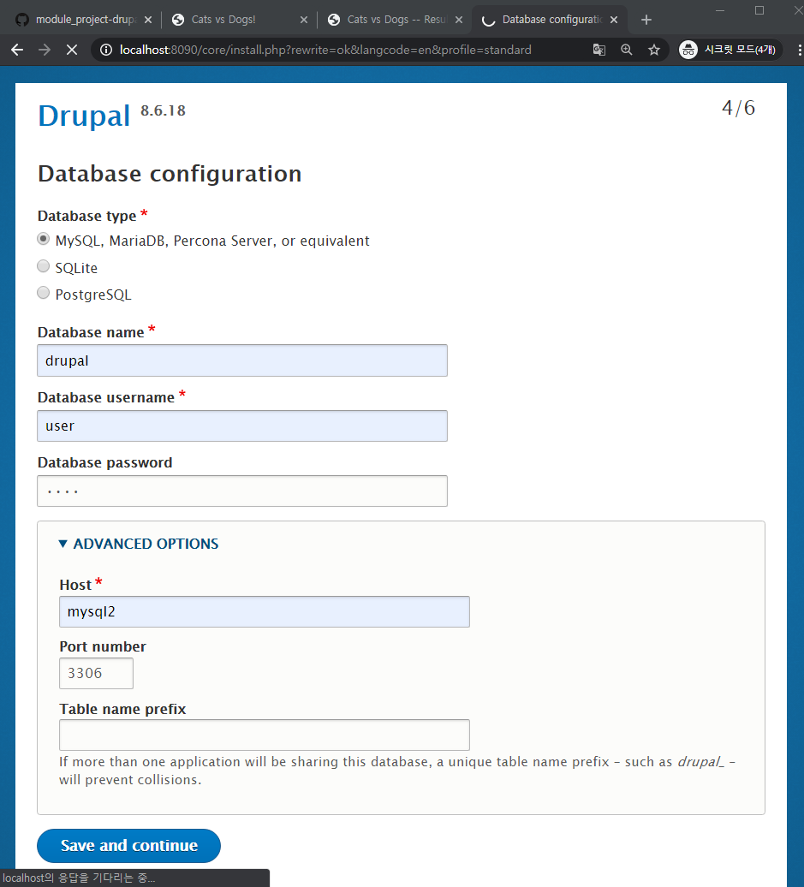
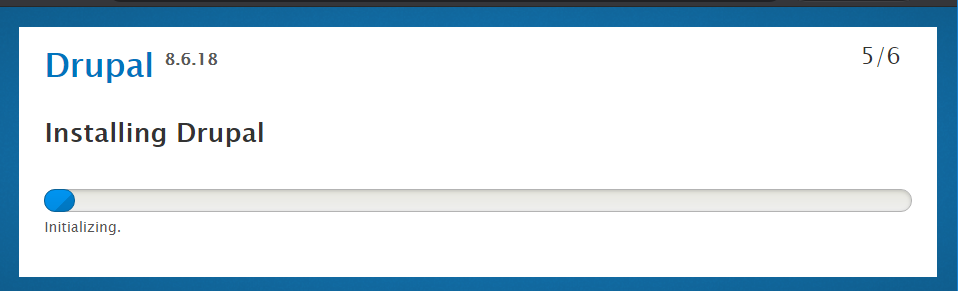
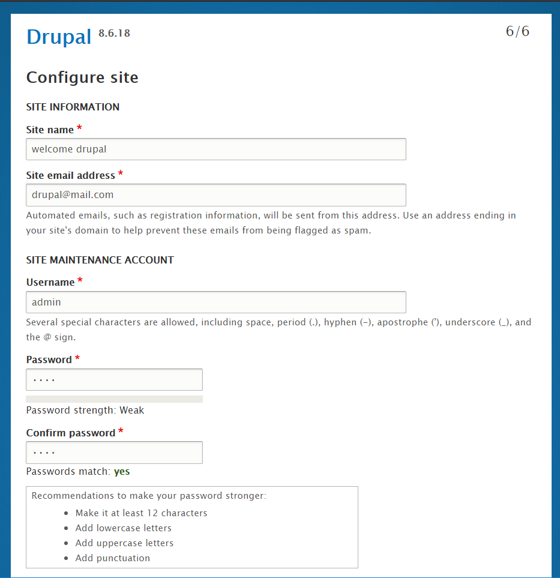
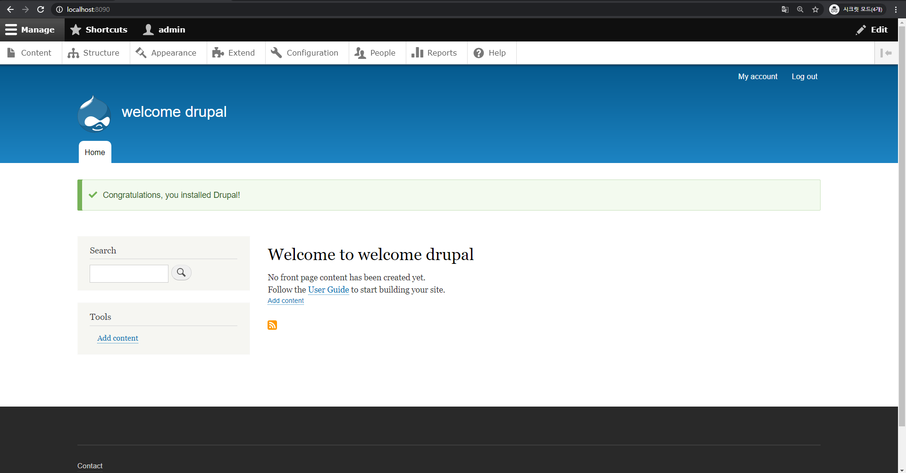
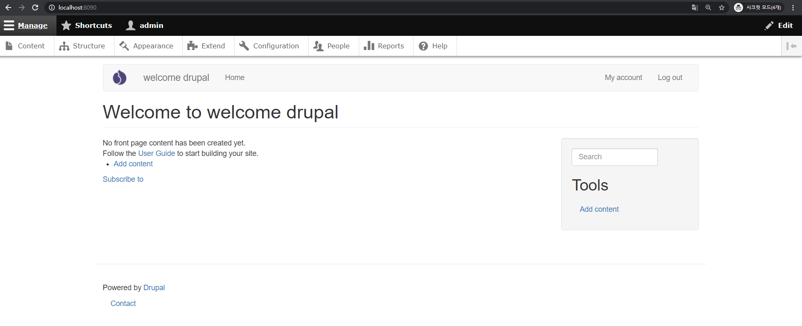

# docker로 drupal 설치 (assignment1, assignment2)

1. dockerfile을 이용해서 drupal 이미지 생성

   ```shell
   $ docker build -t custom-drupal:latest .
   ```

2. docker-compose에 dockerfile로 생성한 이미지를 이용한 custom-drupal과 mysql설치

   drupal 볼륨생성, 8090으로 포트포워딩

   ```shell
   $ docker-compose up
   ```

3. http://localhost:8090 으로 접속

4. 설치(한국어 선택하면 번역설치하는데 엄청 오래걸림 영어추천!)

   

   **ADVANCED OPTIONS에서 docker-compose에서 설정했던 mysql서비스 이름으로 설정**

   

   

   

   **drupal 설치 성공**

5. url 상단 `Appearance` 클릭, 하단 Bootstrap에서 `Install and set as default` 클릭 설치가 끝나면 왼쪽 상단에 있는 `Back to site`를 클릭해서 홈페이지 테마가 변경된것을 알 수 있다.



테마가 적용된 drupal


drupal의 홈페이지 테마나 설치 데이터는 볼륨으로 설정했던 디렉토리 안에 들어가있다.